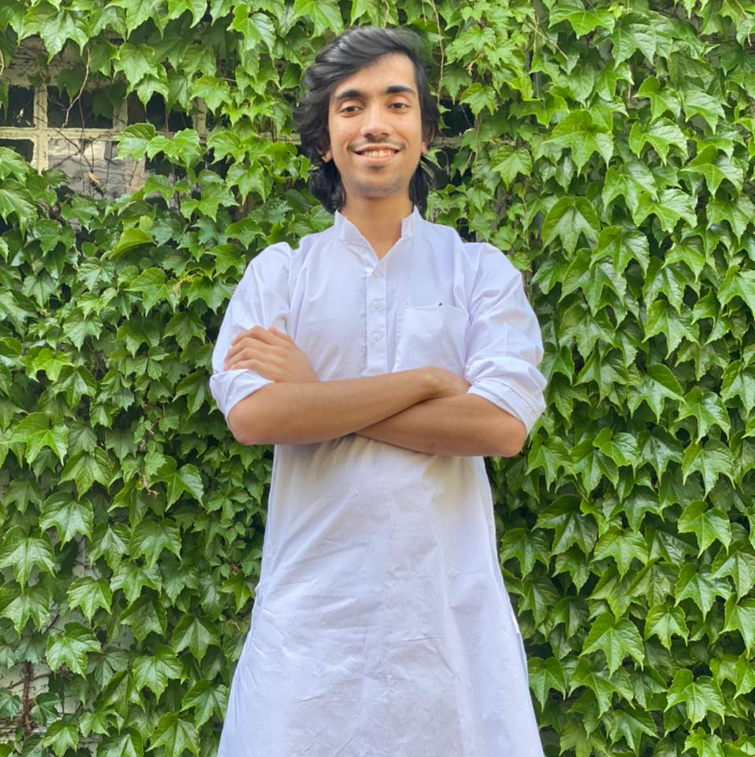

---
# Feel free to add content and custom Front Matter to this file.
# To modify the layout, see https://jekyllrb.com/docs/themes/#overriding-theme-defaults
layout: default
---

  

Hi, I am Baber. I am pursuing my PhD at Rutgers University under the supervision of Dr. Matthew Stone. My general research interests lie in the area of Natural Language Processing with key focus on how to build interactive systems which exhibit human-like behaviour. To read some of my recent work please checkout my <a href="/publications">publications</a>. Other than research some of my hobbies include solving programming problems, thinking about and experimentig with new ideas, playing games, and travelling with friends.

